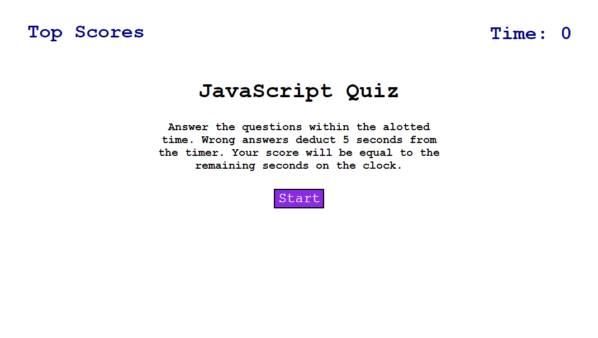

# JavaScript-Quiz

## Description

My Motivation?: To develop my JavaScript API skills.

Why did I build this project?: IT serves as a quiz that I can add to in the future to test my memory of basic coding knowledge and understanding.

What problem did it solve?: This serves to assist in keeping my basic knowledge in check by reminding me of answers to simple questions.

What did I learn: I learned a lot about JavaScript and how it can be used to dynamically alter a webpages style and layout through user interaction. I also learned that I should learn how to properly set up my JavaScript code in the future.

## Installation
No installation Required

## Usage

Website URL: https://danyon-talbot.github.io/JavaScript-Quiz/

## Credits
